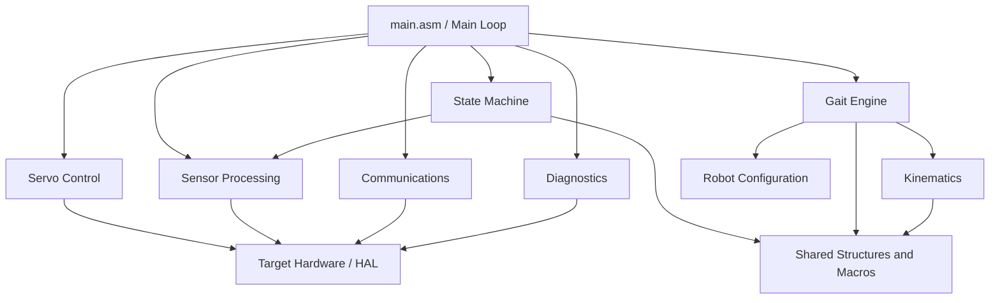

# Component Diagram

```mermaid
flowchart TB
    Main[main.asm / Main Loop]
    SM[State Machine]
    Gait[Gait Engine]
    IK[Kinematics]
    Servo[Servo Control]
    Sensors[Sensor Processing]
    Comm[Communications]
    Debug[Diagnostics]
    Config[Robot Configuration]
    Types[Shared Structures and Macros]
    Hardware[Target Hardware / HAL]

    Main --> SM
    Main --> Gait
    Main --> Servo
    Main --> Sensors
    Main --> Comm
    Main --> Debug
    Gait --> IK
    SM --> Sensors
    Gait --> Config
    SM --> Types
    Gait --> Types
    IK --> Types
    Servo --> Hardware
    Sensors --> Hardware
    Comm --> Hardware
    Debug --> Hardware
```

> The diagram describes the intended module relationships, not a verified runtime call graph. Validate dependencies against the source modules.
